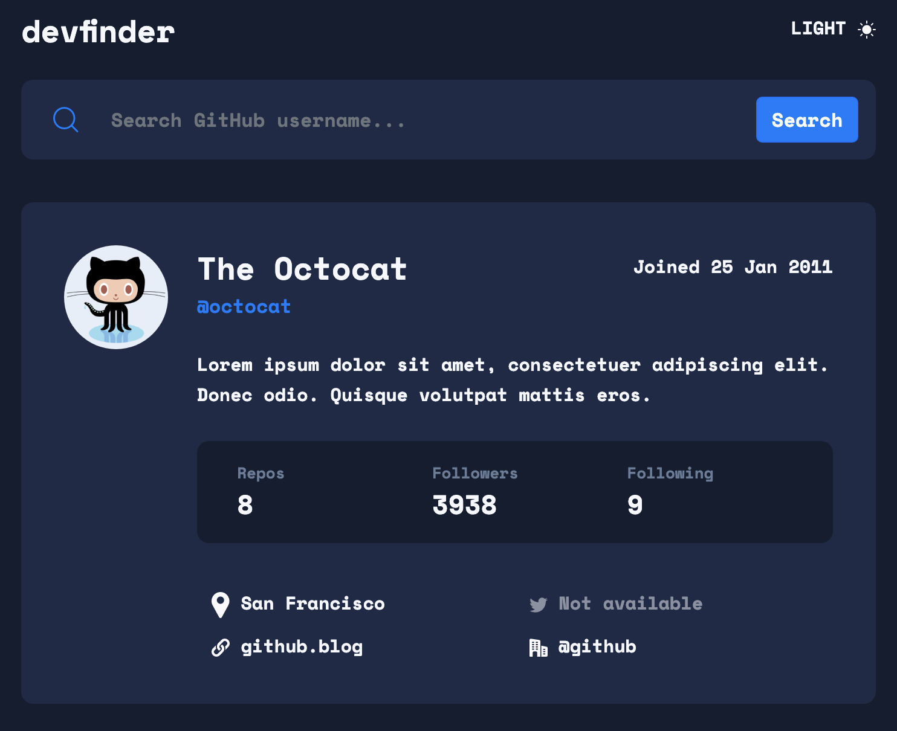

# Frontend Mentor - GitHub user search app solution

This is a solution to the [GitHub user search app challenge on Frontend Mentor](https://www.frontendmentor.io/challenges/github-user-search-app-Q09YOgaH6). Frontend Mentor challenges help you improve your coding skills by building realistic projects. 

## Table of contents

- [Overview](#overview)
  - [The challenge](#the-challenge)
  - [Screenshot](#screenshot)
  - [Links](#links)
- [My process](#my-process)
  - [Built with](#built-with)
  - [What I learned](#what-i-learned)
- [Author](#author)

## Overview

### The challenge

Users should be able to:

- View the optimal layout for each page depending on their device's screen size
- See hover states for all interactive elements on the page
- See their own IP address on the map on the initial page load
- Search for any IP addresses or domains and see the key information and location

### Screenshot

### Links

- Solution URL: [Solution on Github Pages](https://nathanielfischer.github.io/GitHub-User-Search_Frontend-Mentor/)

## My process

### Built with

- HTML5
- CSS
- Bootstrap
- JavaScript
- jQuery

### What I learned

I learned how to get Data from an API via XMLHttpRequest from the client side and overall more experience working with jQuery. 

Furthermore I learned a lot about Bootstrap and basic HTML / CSS.

## Author

- Github - [Nathaniel Fischer](https://github.com/nathanielfischer)